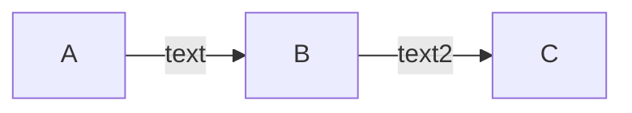

<!--more-->
# Code
## Code in line
Example: basic: "`name`"  
options: you can add options featuring as what you want to highlight
just add (primary), (tip), (warning), (success), (danger) **with one white space**

`name (primary)`

`name (tip)`

`name (warning)`

`name (success)`

`name (danger)`


## Example of code block
```python
close #클릭하면 열립니다
import sys
input = sys.stdin.readline

def getUserInput():
    n = input()
    print(f'user input is : {n}')

if __name__ == '__main__':
    getUserInput()
```

If you add 'close' option into the first line of the code block, you can roll up the code block


### 3개부터는 애니메이션 효과가 사라집니다.
#### 대신 볼드체로 강조됩니다.
##### 또한 개수가 증가할 수록 글자의 크기가 작아집니다.
As you can see, more than 2 #, it just be bolder and smaller 

🥳 이모지 테스트
😤 이모지 테스트

## with & without count
1. 순서를 세고 싶을 땐
2. 넘버링을 하고
   
- 이런 식으로
- 세지 않을 수도
- 있습니다.
  
---
# quotation

> 이것은 인용 예시입니다.  
> 두 line을 개행하여 단락 구분을 할 수도 있고 두 space를 띄워 단락 내 개행을 할 수도 있습니다.
> 
> 기본 인용은 회색으로 표시되며 두 칸을 띄워야 개행이 됩니다.  
> 마찬가지로 옵셥을 추가할 수 있습니다.


> primary
>  'primary' 예약어를 사용한 경우입니다.  
>   주요 문단입니다

> tip
>  'tip' 예약어를 사용한 경우입니다.  
>   팁 문단입니다

> warning
>  'warning' 예약어를 사용한 경우입니다.  
>   경고 문단입니다

> success
>   'success' 예약어를 사용한 경우입니다.  
>   성공 문단입니다

> danger
>   'danger' 예약어를 사용한 경우입니다.  
>    실패(위험) 문단입니다

---
# Picture
Basically, picture has a shadow. so if you don't want to add it, just add `_no` at the end of the text in quotation

1. title with shadow
   ```markdown
   
    ```

    #### result:
    


2. title without shadow
   ```markdown
    
    ```

    #### result:
    

3. without title but shadow
   ```markdown
   
    ```

    #### result:
    

4. without title and shadow
   ```markdown
   
    ```

    #### result:
    


---
# Tap

> ::: tabs와 :::을 탭 컨테이너의 시작과 끝으로 사용하며, @tab을 사용하여 다양한 탭을 표시하고 구분합니다.   
> @tab 다음은 제목이며, 기본적으로 첫 번째 탭이 활성화됩니다.   
> 또한, @tab 다음에 텍스트 :active를 추가하여 해당 탭을 기본적으로 활성화할 수 있습니다.

## example of tap
1. basic use
   
    ```markdown
    <!-- 필수 공백 줄 -->
    ::: tabs <!-- ':::'와 'tabs' 사이에는 반드시 하나의 공백이 있어야 합니다 -->
    <!-- 필수 공백 줄 -->
    @tab jay<!-- '@tab'과 제목 사이에는 반드시 하나의 공백이 있어야 합니다 -->
    <!-- 필수 공백 줄 -->
    Hi I'm jay!
    <!-- 필수 공백 줄 -->
    @tab lay
    <!-- 필수 공백 줄 -->
    I'm lay!
    <!-- 필수 공백 줄 -->
    @tab kelvin
    <!-- 필수 공백 줄 -->
    yeah I'm kelvin!
    <!-- 필수 공백 줄 -->
    :::
    <!-- 필수 공백 줄 -->
    ```

    
::: tabs

@tab jay

Hi I'm jay!

@tab lay

I'm lay!

@tab kelvin

yeah I'm kelvin!

:::


2. option `:active`
   
   ```markdown
    <!-- 필수 공백 줄 -->
    ::: tabs
    <!-- 필수 공백 줄 -->
    @tab jay
    <!-- 필수 공백 줄 -->
    Hi I'm jay!
    <!-- 필수 공백 줄 -->
    @tab:active lay
    <!-- 필수 공백 줄 -->
    I'm lay!
    <!-- 필수 공백 줄 -->
    @tab kelvin
    <!-- 필수 공백 줄 -->
    yeah I'm kelvin!
    <!-- 필수 공백 줄 -->
    :::
    <!-- 필수 공백 줄 -->
    ```

::: tabs

@tab jay

Hi I'm jay!

@tab:active lay

I'm lay!

@tab kelvin

yeah I'm kelvin!

:::


1. option `#id`  
    you can add 'id' into the tap container and if two containers have same 'id', they share tap switching event.

    ```markdown
    <!-- 필수 공백 줄 -->
    ::: tabs#install
    <!-- 필수 공백 줄 -->
    @tab npm
    <!-- 필수 공백 줄 -->
    npm을 사용하여 xxx설치
    <!-- 필수 공백 줄 -->
    @tab Homebrew
    <!-- 필수 공백 줄 -->
    Homebrew를 사용하여 xxx설치
    <!-- 필수 공백 줄 -->
    @tab MacPorts
    <!-- 필수 공백 줄 -->
    MacPorts를 사용하여 xxx설치
    <!-- 필수 공백 줄 -->
    :::
    <!-- 필수 공백 줄 -->
    ```


    ```markdown
    <!-- 필수 공백 줄 -->
    ::: tabs#install
    <!-- 필수 공백 줄 -->
    @tab npm
    <!-- 필수 공백 줄 -->
    npm을 사용하여 yyy설치
    <!-- 필수 공백 줄 -->
    @tab Homebrew
    <!-- 필수 공백 줄 -->
    Homebrew를 사용하여 yyy설치
    <!-- 필수 공백 줄 -->
    @tab MacPorts
    <!-- 필수 공백 줄 -->
    MacPorts를 사용하여 yyy설치
    <!-- 필수 공백 줄 -->
    :::
    <!-- 필수 공백 줄 -->
    ```


<!-- 필수 공백 줄 -->
::: tabs#install
<!-- 필수 공백 줄 -->
@tab npm
<!-- 필수 공백 줄 -->
npm을 사용하여 xxx설치
<!-- 필수 공백 줄 -->
@tab Homebrew
<!-- 필수 공백 줄 -->
Homebrew를 사용하여 xxx설치
<!-- 필수 공백 줄 -->
@tab MacPorts
<!-- 필수 공백 줄 -->
MacPorts를 사용하여 xxx설치
<!-- 필수 공백 줄 -->
:::

<!-- 필수 공백 줄 -->
::: tabs#install
<!-- 필수 공백 줄 -->
@tab npm
<!-- 필수 공백 줄 -->
npm을 사용하여 yyy설치
<!-- 필수 공백 줄 -->
@tab Homebrew
<!-- 필수 공백 줄 -->
Homebrew를 사용하여 yyy설치
<!-- 필수 공백 줄 -->
@tab MacPorts
<!-- 필수 공백 줄 -->
MacPorts를 사용하여 yyy설치
<!-- 필수 공백 줄 -->
:::
<!-- 필수 공백 줄 -->

---
# mermaid
you can draw graph and flow chart with mermaid.

```markdown
    ```mermaid
    flowchart LR
        A -- text --> B -- text2 --> C
    ```
```




more usage in here: https://mermaid.js.org/#/

---
# math

1. math in line

```markdown
    ```math
    "<!-- '\(' 와 '\)' 로 인라인 수식의 시작과 끝을 표시 -->"
    행내 공식입니다：\( x = {-b \pm \sqrt{b^2-4ac} \over 2a} \)
    ```
```


```math
행내 공식입니다：\( x = {-b \pm \sqrt{b^2-4ac} \over 2a} \)
```


2. math in block

```markdown
    ```math
    "<!-- '$$' 와 '$$' 로 수식 블록의 시작과 끝을 표시 -->"
    블럭 내 공식입니다：$$ x = {-b \pm \sqrt{b^2-4ac} \over 2a} $$
    ```
```

```math
블럭 내 공식입니다：$$ x = {-b \pm \sqrt{b^2-4ac} \over 2a} $$
```

more usage in here: mathjax: https://www.mathjax.org